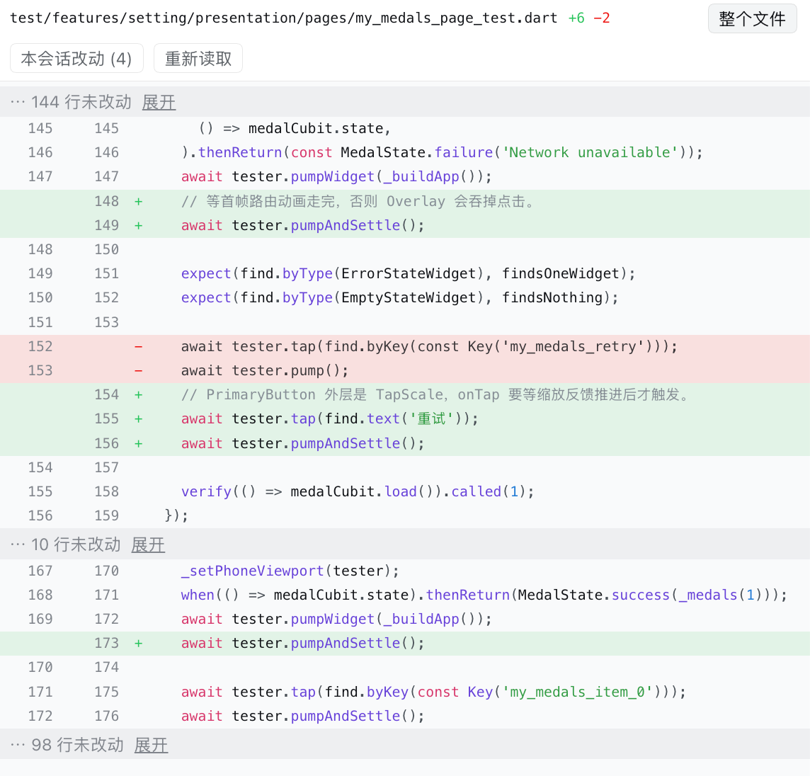

# dsh-session-diff

DSH Web 右侧栏的「按会话」diff 标注。

[English](README.md) | [简体中文](README.zh.md)

打开一个**当前对话**改动过的文件时，右侧栏会以 git 风格标出新增/删除行并保留语法高亮；另有一个配套页面列出本次对话改过的每个文件。



## 它做什么

- **装饰文件视图。** `write` / `edit` 工具行本来就会在右侧栏打开被改动的文件。本插件的 tab type 只认这些地址（带扩展名优先级，且只在该会话对这个路径确实有改动时才生效），所以同一次点击现在打开的是带 diff 的视图：
  - 增删行的绿/红底色，以及 `+` / `-` 行标记；
  - 类似 `git diff` 的新旧双行号；
  - 整文件语法高亮；
  - 头部显示 `+新增 −删除`、「仅看改动 / 整个文件」切换（仅看改动会折叠大段未改动内容）、以及「重新读取」按钮。
- **会话改动页。** 配套的 tab type 列出本次对话改过的文件，带每文件 `+/−` 计数和所在目录；点任意一条即进入上面的视图。可从文件视图头部的按钮或右侧栏引导页进入。
- **实时更新。** 标注跟随对话：每产生一次新编辑，就重新读取文件并重算 diff。

本次对话**没有**改动过的文件仍走自带文本查看器——`canOpen` 只否决自己真正装饰的地址，所以图片、PDF、Markdown 以及其它文档渲染器的行为完全不变。

## 安装

### 用户（推荐：一条命令）

```bash
dsh plugin --profile web add github:2002XiaoYu/dsh-session-diff   # 也可以 file:/path/to.tgz
# 重启 `dsh web`（dsh.profile.bundles 只在启动时读取一次）
# 强制刷新浏览器（Cmd+Shift+R）
```

目前还没有发布到 npm，所以从仓库安装：`lib/` 与 `src/` 一起提交在仓库里，源码安装**不需要构建**。同一份预构建产物也挂在 Release 上，不想克隆仓库就直接装：

```bash
dsh plugin --profile web add https://github.com/2002XiaoYu/dsh-session-diff/releases/download/v0.1.0/dsh-session-diff-0.1.0.tgz
```

等包发到 npm 之后，同一条命令把参数换成 `dsh-session-diff` 即可。

`dsh plugin` 会把包装进 profile；因为包声明了 `dsh.bundle.patch`，它同时会被注册进 `dsh.profile.bundles`，作为一个 profile layer。卸载同样是一条命令，不用手工改配置：

```bash
dsh plugin --profile web remove dsh-session-diff
```

安装插件没有 GUI 入口——Settings → Plugins 页面只能查看和移除已安装的插件，不能新增。

### 从源码（仅开发用）

```bash
npm run build                     # src/*.js -> lib/client.js（纯 node，跨平台）
bash install.sh                   # 复制到 ~/.dsh/plugins、建软链、加一行 patch layer
```

这条路径走 profile 的 `cordis.patch.yml` 而不是 bundle 列表，所以 `patchReload: live` 能让它免重启 `dsh web` 生效——迭代时很方便。它有两条规矩：

1. **两条路径绝不要混用。** 如果包已经在 `dsh.profile.bundles` 里，手工 patch 行会把同一条 loader 行插两次；`install.sh` 遇到这种情况会拒绝执行。
2. **`cordis.patch.yml` 必须始终是顶层 YAML 数组。** 移除那一行时，把文件留成 `[]`。只有注释的文件会被解析成 `null`，`dsh web` 会以 *"must be a top-level YAML array of loader patches"* 拒绝启动。

检查某个 profile 是否干净：

```bash
dsh --profile web --dump-config | grep -c dsh-session-diff    # 未安装时输出 0
```

## 环境与兼容性

- 针对 DSH `0.1.5-rc.1`（React 18 客户端运行时）测试。浏览器端只 require 平台种子模块——`react`，可选 `@deepseek-ai/dsh-client-ui-primitives`——其余全部从 cordis context 读取，所以它不需要自带 React 或 UI 套件。
- **没有任何宿主端行为。** host 半边是空的 `apply`：插件不起 shell、不跑 `git`、不直接碰文件系统。文件内容通过 DSH 自己的 `workspaceFiles` remote 读取，diff 来自对话里的工具结果。
- 无运行时依赖、无 peer 依赖，除了包本身没有别的东西要装。
- 安装或升级后重启 `dsh web`；之后纯客户端改动只需要刷新浏览器。

## 适用范围与限制

- **只针对当前对话。** 数据来源是你正在看的这个会话里的 `write` / `edit` 结果。别的对话改的、手工改的、本次对话之前就有的改动都不会显示——那些请用 git。
- **超长对话会丢掉最早的条目。** 改动列表来自客户端保留的对话窗口；节点已经滚出该窗口的 hunk 不再列出。
- 文件最多读取 20 000 行，按 600 行分页。
- hunk 路径与地址路径按后缀匹配（绝对路径 hunk 对工作区相对地址，反之亦然）。错误匹配不会说谎：hunk 自己的文本必须仍能在文件里找到，否则视图会降级并明确说明。
- 文本已经不在文件里的 hunk（在本对话之外被改写）会被标为未定位，其余部分照常渲染。
- 已删除的文件报告读取失败，而不是崩溃。
- tokenizer 是手写扫描器，覆盖常见语言（Dart、JS/TS、JSON、YAML、Python、shell、CSS、HTML/XML、Markdown、SQL、Java/Kotlin/Swift/C 系、Go、Rust、PHP）。不支持的扩展名不着色。

## diff 是怎么算出来的

`write` / `edit` 的结果带有 `meta.diffs`，即 `FileDiff = {path, oldText, newText}` 数组。每个条目是一个已应用的 hunk，两侧各带 3 行上下文，而且**没有行号**（dsh-tool-fs 用 `structuredPatch(..., {context: 3})` 生成；只有当 hunk 完全没有旧行时 `oldText` 才是 `null`）。因此整文件、git 风格的标注无法直接从 hunk 读出来，于是：

1. 把当前文件文本**反向**走一遍本次对话的 hunk，把每个 hunk 的 `newText` 换回它的 `oldText`，从而重建对话前的文本（出现位置的选择带提示，重复片段会就地解析）；
2. 用有界 Myers diff 对重建出的基准文本和当前文本做行级比对；
3. 这时才得出行的类型、双行号槽位与 `+/−` 计数。

## 构建、测试、发布

```bash
npm install       # devDependencies：jsdiff（真实 hunk 夹具）、react + react-dom（SSR 夹具）
npm run build     # node scripts/build.mjs -> lib/client.js（含契约检查）
npm test          # diff 引擎、tokenizer、地址、bundle 加载、注册、SSR 渲染
```

两个夹具都留了逃生口，没有 `node_modules` 也能跑：`DSH_INSTALL=<一个 dsh 安装目录>` 从 DSH 安装里取 jsdiff，`REACT_DIR=<含 react 与 react-dom 的目录>` 提供渲染器。

`scripts/build.mjs` 刻意不是一个打包器。DSH 客户端 bundle 是单个 lazy-CJS 文件：执行它只注册 `window.__ModuleLoader__.load({id, factory})`，factory 体内只能 require 九个平台种子词。本插件除 React 与 cordis context 外什么都不需要，所以 bundle 就是把 `src/*.js` 依次拼接进那个 wrapper。

发布：

```bash
npm login
npm publish                        # 不带作用域的名字，不需要 --access 参数
```

包名不带作用域（`dsh-session-diff`），所以不需要先拥有任何 npm 组织或作用域。带作用域的名字必须归发布者所有，否则 `npm publish` 会以 403 失败；GitHub owner 与 npm 账号也不必一致——本仓库在 `2002XiaoYu/dsh-session-diff`。改名是安全的：`scripts/build.mjs` 从 `package.json` 读名字，把它注入为 bundle 的 loader id，并在 `cordis.patch.yml` 仍注册旧名字时让构建失败。

`prepack` 会从 `src/` 重新构建 `lib/client.js`，所以发布产物不可能与源码脱节。刻意没有 `prepare`：npm 和 pnpm 10+ 会拦截被安装依赖的生命周期脚本，装的时候构建会被静默跳过。因此使用者永远不会在本地跑构建——这也意味着**基于 git 的安装需要 `lib/` 已提交**，因为那里不会重新构建。registry 路径和 `dsh plugin add <file.tgz>` 都是自包含的。

## 目录结构

```text
src/00-head.js       loader wrapper + React requires
src/10-util.js       地址、路径、文案、样式
src/20-tokenizer.js  零依赖语法扫描器（映射到 --shiki-token-* 变量）
src/30-diff.js       hunk 收敛、基准重建、Myers 行 diff、行模型
src/40-reader.js     通过 workspaceFiles Remote 读取整文件（分页）
src/50-store.js      对话/会话绑定、按文件的 hunk 聚合、外部 store
src/60-ui-file.js    带标注的文件视图 + tab 标题
src/70-ui-changes.js 会话改动页 + tab 标题
src/80-apply.js      tab type 与 slot 注册
src/99-tail.js       module.exports
scripts/build.mjs    全部构建逻辑
test/                逻辑夹具 + bundle/注册/SSR 夹具
```
